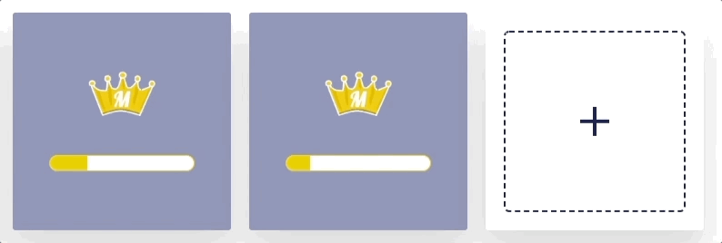
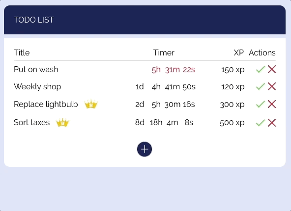
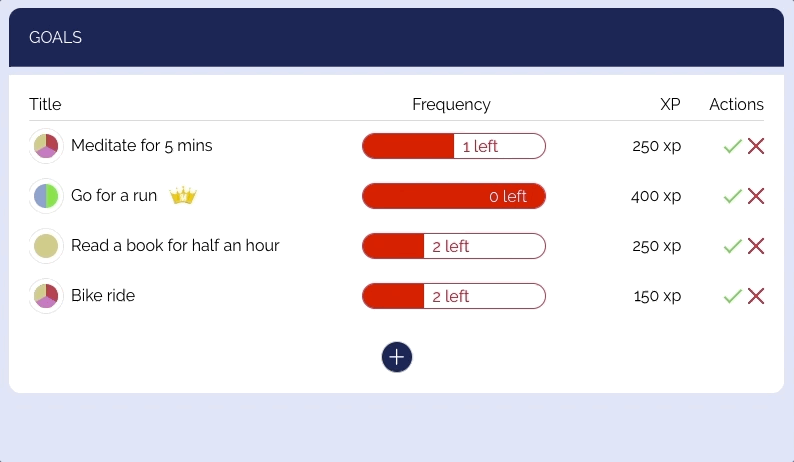

## Meritokracy - Another productivity web app

#### A fully interactive dashboard combining your to-do list, good habits and guilty pleasures to boost motivation and persistence using visuals, gamification and other incentives

### Stack

- Ruby on Rails Rest API (GraphQL integrated but not fully connected to the client)
- React
- Redux
- User token authentication between API and client
- Postgresql

## Animations

#### Rewards list

#### Reward form

#### Interactive chart with custom built menu

#### To-do list

#### Habit list

#### Activity list

## Backend

#### Chart data

Chart data is initially queried and formatted by the API. All updates using the interactive menu are formatted in React

#### Streaks

Checking whether an activity for a goal or to-do qualifies for bonus XP

#### GraphQL

Implemented a GraphQL schema for the API to make queries and mutations

## TODO

- Add content section to README
- Add Elasticsearch for querying data
