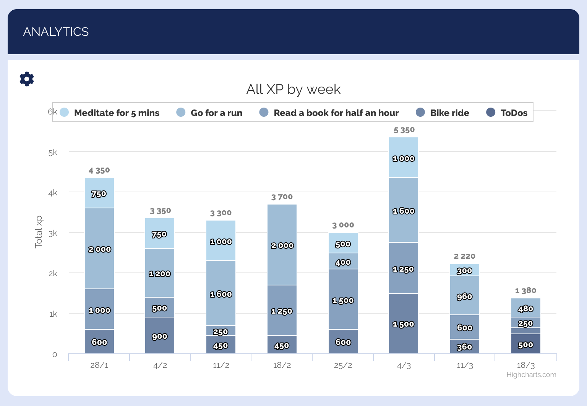
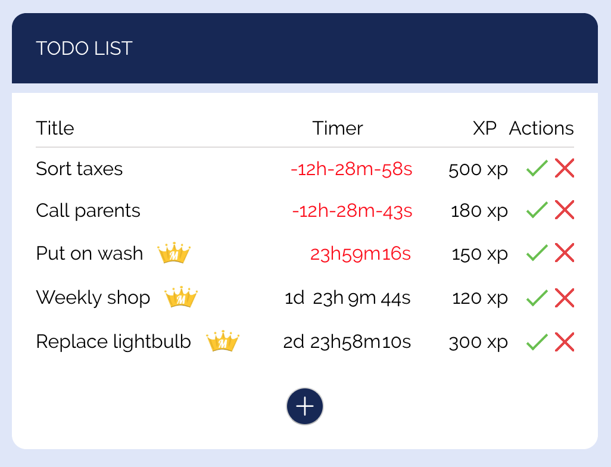
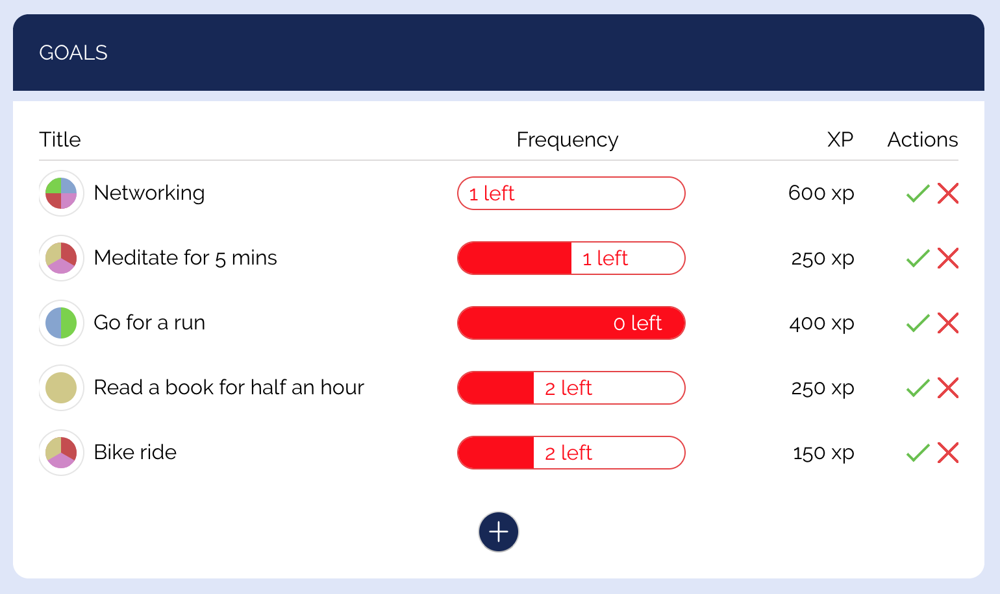
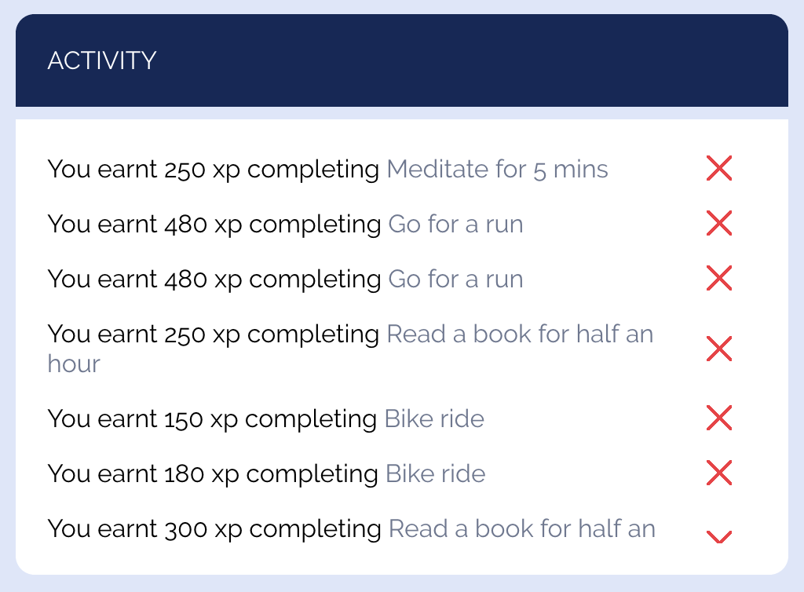

## Merit - Another productivity web app

#### Combining your to-do list, good habits and guilty pleasures to boost motivation and persistence using visuals, gamification and other incentives

### Stack

- Ruby on Rails Rest API (GraphQL integrated but not fully connected to the client)
- React
- Redux
- User token authentication between API and client
- Postgresql

## Animations

#### Rewards list

#### Reward form

#### Interactive chart with custom menu

#### To-do list\

#### Habit list

#### Activity list

## Backend

#### Chart data

#### Streaks

#### GraphQL
